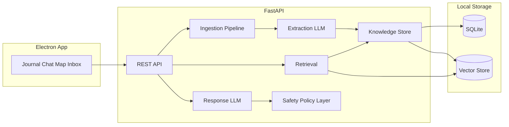

# AIC MVP Build Plan

## Architecture summary

- **Frontend**: Electron app (packaged desktop) — Journal, Chat, Knowledge Map, Proposed Insights Inbox, Settings.
- **Backend**: Python FastAPI service (runs locally; Electron starts/stops it or talks to existing process).
- **Data**: SQLite (items, entities, relations, provenance, config) + local vector store (e.g. Chroma or `sqlite-vec` / `sqlite-vss`) for semantic retrieval.
- **LLM**: Local or API-based (e.g. Ollama, or OpenAI-compatible API); all prompts and policies implemented in backend.

---

## Phase 1: Foundation and local ingestion

**Goal**: Run the stack locally, persist data, and ingest from local folders only.

- **1.1 Project layout**
  - Monorepo or two repos: `aic-backend` (FastAPI), `aic-electron` (Electron + React or similar).
  - Backend: `app/` (routes, services), `ingestion/`, `storage/`, `llm/`, `safety/`. Config via env + SQLite.
  - Electron: spawn/terminate backend process, or detect already-running backend; proxy API to `http://localhost:<port>`.
- **1.2 Data model and storage**
  - **SQLite schema** (align with spec §4):
    - `items` (id, source_type, source_ref, path_or_id, content_hash, raw_meta, created_at, ingestion_status).
    - `entities` (id, type e.g. person/project/emotion/belief, label, created_at).
    - `relations` (id, from_entity_id, to_entity_id, relation_type, created_at).
    - `provenance` (id, target_type, target_id, source_item_id, extracted_at, classification, confidence, extracted_by).
    - `journal_entries` (id, content, structured_fields JSON, created_at, user_id).
    - `chat_messages` (id, role, content, mode, created_at, session_id).
    - `proposed_insights` (id, insight_type, content, supporting_sources JSON, status: pending/accepted/rejected/later, created_at).
  - **Vector store**: Embedding table or Chroma collection keyed by item_id (and optionally chunk_id). Store only what’s needed for retrieval; no raw secrets.
- **1.3 Secrets and security (MVP baseline)**
  - Store API keys / OAuth tokens in OS keychain (e.g. `keyring`) or encrypted SQLite with user passphrase; never in logs or prompts (§7.1, §7.2).
  - Backend requires a simple local auth (e.g. passphrase-derived key or token) so only the app can call the API; Electron can hold a short-lived token after user unlocks (§7.4).
  - No external telemetry; minimal local logs, no content (§7.5).
- **1.4 Local folder connector**
  - Config: list of allowed directories (from setup wizard or settings).
  - Scan files (e.g. `.txt`, `.md`, `.pdf`, `.docx`); store path + content hash; skip unchanged files (§3.1.4, §3.3).
  - Chunk long documents; call extraction LLM per chunk; write to `items`, `entities`, `relations`, `provenance`; write embeddings for retrieval.
  - Ingestion status: new / processed / failed / skipped (§3.3).
- **1.5 Extraction behavior (first cut)**
  - Extract: people, topics, projects, events, emotions (explicit), beliefs/assumptions as **hypotheses only** (§5.1).
  - Every entity/relation has provenance: source item, timestamp, classification (fact/claim/interpretation/hypothesis), confidence (§4.2).
  - **High-impact gating**: identity, mental-health labels, relationship conclusions, metaphysical-as-fact → do not auto-save; create rows in `proposed_insights` (§5.2).
- **1.6 Journal + minimal Chat (no retrieval yet)**
  - **Journal**: Create entries (freeform + optional structured fields); store in `journal_entries` and as first-class items in the knowledge store; timestamp and optional tags (§2.1.1).
  - **Chat**: Single mode (Journal Mode) only; no retrieval; LLM responds from system prompt only. Persist messages in `chat_messages`.
  - Electron UI: simple Journal view and Chat view; backend REST for create/list.

**Deliverables**: Backend runs locally; SQLite + vector DB populated from local folders; journal and chat work without personal retrieval; secrets not in logs/prompts.

---

## Phase 2: Retrieval, response policy, and Proposed Insights

**Goal**: Chat and journal responses use retrieved personal context; high-impact insights go to an Inbox; transparency and agency preserved.

- **2.1 Retrieval pipeline (§6.1)**
  - Input: current user message (and optional current journal entry).
  - Semantic search over embeddings (vector store); optional graph expansion (1–3 hops) from matched entities in SQLite.
  - Recency and user-pinned importance (e.g. flag on items/entities) in ranking.
  - Return a **small, relevant slice** (configurable max items/chunks); avoid dumping raw sensitive content unless necessary.
- **2.2 Response generation and policies (§6.2, §6.3)**
  - System prompt enforces: agency, dignity, no diagnosis, no moralizing; small achievable steps in Coach mode; motivational interviewing in Coach mode.
  - Modes: Journal (reflective), Coach (MI, small steps), Exploration (knowledge-seeking; no personal data unless asked), Crisis-aware (grounding, outward-facing, no debate).
  - Backend detects mode from UI or heuristics; optional mode switch by user.
  - **Distress detection** (§6.4): simple keyword/signal check; if triggered → Crisis-aware behavior, grounding steps, encourage human/professional contact; no auto-contact.
  - **Labeling**: Directly sourced (with refs), summarized (with refs), inferred hypothesis (clearly marked). “Sources used” / “Why am I seeing this?” in UI (§2.2).
  - Citations: default metadata-level (e.g. subject/date/filename) so not distracting (§10).
- **2.3 Proposed Insights Inbox (§6.2, §10)**
  - When LLM would emit a high-impact inference (identity, mental-health label, relationship conclusion, metaphysical-as-fact): backend does **not** write to entities/relations; instead creates `proposed_insights` with “Why I think this” (supporting sources).
  - Electron: **Proposed Insights Inbox** view (outside chat): list pending items; actions Accept / Reject / Later.
  - Accept → merge into knowledge graph (entities/relations + provenance). Reject → log only. Later → leave pending.
- **2.4 Chat and Journal using retrieval**
  - Journal: after saving an entry, optionally “reflect on this” → same retrieval + response pipeline with entry as context.
  - Chat: every user message → retrieve → generate response with cited sources and labels; show mode in UI.

**Deliverables**: Chat and journal responses grounded in personal data with provenance; Proposed Insights Inbox implemented; distress handling and mode switching in place.

---

## Phase 3: Gmail and export-based connectors

**Goal**: Ingest Gmail (read-only) and at least one export-based source (e.g. Facebook “Download Your Information”); reuse same extraction and storage pipeline.

- **3.1 Gmail connector (§3.1.1)**
  - OAuth2 read-only scope (e.g. Gmail read); tokens in keychain/encrypted store.
  - Ingest: message metadata (from/to/date/subject), body; attachments optional and user-controlled.
  - Store stable message IDs; cache content per user config; incremental: skip already-ingested IDs unless user requests refresh.
  - Same extraction + provenance + embedding pipeline as local files; high-impact → Proposed Insights.
- **3.2 Export-based connector (e.g. Facebook DYI) (§3.1.3)**
  - User uploads or points to unzipped “Download Your Information” (or similar) folder.
  - Parser for the export format (e.g. JSON/HTML); normalize to “items” (posts, reactions, etc.); store item refs and hashes; incremental by item ID/hash.
  - Run same extraction and storage as other connectors; no live API in MVP.
- **3.3 YouTube (§3.1.2)** (if in scope for MVP)
  - Prefer export/API path for watch history, liked videos, subscriptions; store references and metadata; same item/entity/relation pipeline.
- **3.4 Ingestion configuration (§3.2, §8)**
  - Settings: enable/disable per connector; scope (e.g. metadata-only vs full text); schedule (manual or periodic).
  - Setup wizard: guide for connectors, folders, security (passphrase, lock timeout).

**Deliverables**: Gmail and at least one export-based source ingest without reprocessing unchanged items; config and wizard in place.

---

## Phase 4: Knowledge Map and UX polish

**Goal**: User can explore the knowledge graph and adjust session/transparency behavior.

- **4.1 Knowledge Map (§2.1.3)**
  - Backend: API to list entities (with type) and relations (with type); optional filter by type.
  - Electron: basic view — node list + relationship list (or simple graph viz with a library); click node/edge → detail panel: provenance, confidence, type (fact/claim/interpretation/hypothesis), last updated.
  - No need for full graph visualization in MVP; “navigable representation” can start as list + filters + detail.
- **4.2 User edits and lifecycle (§4.3)**
  - Allow: edit entity labels, merge duplicates, delete entities/relations, mark inferences as accepted/rejected/later (align with Proposed Insights and direct edits on map).
  - Merge: simple “merge A into B” updates relations and provenance.
- **4.3 Contradiction handling (§5.3)**
  - When new extractions contradict existing accepted knowledge: detect (e.g. same entity, opposite relation or claim); present as “Potential conflict” with sources; options: keep both (different times), prefer one, mark uncertain. Implement as a small workflow (e.g. in Proposed Insights or a dedicated “Conflicts” list).
- **4.4 Non-addictive UX (§2.3)**
  - Configurable session limits; soft nudge after prolonged use; no streaks/badges/points.
  - Encourage outward-facing actions in responses (contact a friend, take a walk, rest, therapy) when appropriate.
- **4.5 Export and delete (§7.6, §10)**
  - Export: journal entries, knowledge graph (e.g. JSON/CSV), config (no secrets).
  - “Delete all data”: verifiable wipe of SQLite and vector store (and any local caches).

**Deliverables**: Knowledge Map view and basic CRUD on entities/relations; contradiction workflow; session limits and export/delete.

---

## Phase 5: Safety hardeners and packaging

**Goal**: Prompt-injection defense, optional local encryption, and shipable Electron app.

- **5.1 Prompt-injection defenses (§7.3)**
  - Treat all ingested content as untrusted; do not execute instructions found in content.
  - Policy layer: least-privilege retrieval (only what’s needed for the query), connector scopes respected, refuse “dump everything” style requests.
  - Sanitize or separate user content from system instructions in LLM calls.
- **5.2 Local encryption (§7.2)**
  - User passphrase or OS keychain for encrypting SQLite (or sensitive columns) and stored tokens; unlock on app start.
- **5.3 Electron packaging**
  - Build backend into a single executable (e.g. PyInstaller) or bundle Python runtime; Electron main process starts backend and ensures only one instance.
  - Installer (e.g. Windows MSI/portable, macOS DMG) and clear “first run” flow (setup wizard).

**Deliverables**: Prompt-injection mitigations, encryption option, single installable desktop app.

---

## Suggested tech choices (concrete)

| Layer    | Choice                                                                    | Rationale                                                                 |
| -------- | ------------------------------------------------------------------------- | ------------------------------------------------------------------------- |
| Backend  | Python 3.11+ FastAPI                                                      | Good for async I/O, LLM SDKs, pandas/export parsing, keyring.             |
| DB       | SQLite                                                                    | Single file, no server; fits local-first.                                 |
| Vector   | Chroma (local) or sqlite-vec                                              | Chroma: simple API. sqlite-vec: one less dependency, same file as SQLite. |
| LLM      | Ollama (local) or OpenAI-compatible API                                   | Configurable; keep prompts and policies in backend.                       |
| Electron | Electron + React (or Vite+React)                                          | Reuse components for Journal, Chat, Inbox, Map, Settings.                 |
| Auth     | Passphrase → key derivation; store token in memory; optional lock timeout | Matches “local authentication” and “passphrase” in spec.                  |

---

## Acceptance criteria checklist (from spec §10)

- User can create journal entries and chat with AIC; AIC uses retrieved personal context and labeled sources.
- Proposed Insights Inbox present; citations default to metadata-level.
- Ingest from: Gmail, YouTube (or export), local folders, user input (journal/chat).
- Store entities/relations with provenance; no reprocessing of unchanged items.
- High-impact insights proposed for approval, not auto-committed.
- Secrets not in prompts/logs; auth/connector data encrypted at rest; connectors read-only.
- Responses preserve agency, avoid diagnosis, offer achievable alternatives.
- Clear export/delete workflow.

---

## Risk and scope notes

- **LLM quality**: Extraction and response quality depend on model and prompt design; plan for iterative prompt and policy tuning.
- **Spiritual/teaching content (§6.2)**: Implement as optional “lens” in prompts (e.g. Seth, Adyashanti) with clear labeling and at least one non-spiritual alternative; lower priority than core retrieval and Proposed Insights.
- **YouTube/Facebook**: Parsing export formats can be fiddly; prioritize “one export path” (e.g. Facebook DYI) over multiple platforms if time is short.

This plan is ordered so that **Phases 1–2** deliver a usable “journal + chat with my data + Proposed Insights” experience; Phases 3–5 add connectors, map, safety, and packaging.