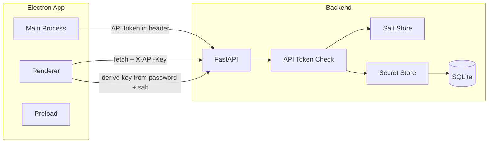

# Security Hardening and Secret Store Plan

## Conflicts and Considerations

**1. Password reset via email**

- You asked for reset to "send a reset link to [krivkin82@gmail.com](mailto:krivkin82@gmail.com)" and for that link to prompt for a new password on next login.
- The app does **not** currently send email (no SMTP, no email API). Implementing this requires:
  - Choosing a mechanism (e.g. SMTP with app credentials, or a service like SendGrid) and storing credentials securely.
  - Defining what the "reset link" opens: e.g. custom protocol `aic://password-reset?token=...` to open the app, or a small web app that tells the user to open AIC.
  - Backend (or a small service) to generate a one-time token, store it with expiry, send the email, and later validate the token when the user sets a new password.
- **Recommendation:** Implement the rest of the plan first. For "Reset" in Security, ship a "Reset" that only shows a message "Reset link would be sent to [krivkin82@gmail.com](mailto:krivkin82@gmail.com)" and implement actual sending in a follow-up. The plan below assumes (b) unless you want to add an email-sending step now.

**2. Reset invalidates existing encrypted secrets**

- If the user sets a **new** password (e.g. after clicking the reset link), we will use a new salt/key derivation. Existing secrets (e.g. Gmail token) are encrypted with the **old** key and cannot be decrypted without the old password.

**Implication:** After a real password reset, the app must treat stored secrets as invalid (e.g. clear stored ciphertext for the Gmail key) and the user must re-enter the Gmail API key in Connections > Gmail. This should be documented in the UI (e.g. "After reset you will need to re-enter your Gmail key").

**3. One application password, two entry points**

- The same "application password" is used to:
  - **Security:** "Save" stores/confirms it (we never store the raw password; we store a verification hash and/or use it to derive the key for the secret store).
  - **Connections > Gmail:** User enters it to unlock the Gmail key for view/edit.
- So there is a single password; Security is where the user sets/changes it, and Connections > Gmail is where they use it to access the token. No conflict, but the flow must be consistent (first-time: set password in Security, then use it in Gmail).
- If no password is currently stored, the app should prompt the user to enter and save on startup.

**4. Key derivation on client vs backend**

- You asked to prefer deriving a key on the client and sending only the derived key (so the passphrase is never sent).
- Today the backend accepts a **passphrase** and derives the key in [app/security/encryption.py](aic-backend/app/security/encryption.py) (PBKDF2 + Fernet). To avoid sending the passphrase we have two options:
  - **Option A (recommended):** Add backend support for a **derived key**: client derives key (same algorithm: PBKDF2 with salt, 100k iterations, base64), sends that key in requests; backend uses it only for Fernet encrypt/decrypt and never sees the password. Backend stores and returns a **salt** (per app or per secret) so the client can derive the same key when the user enters the password again.

**5. Where to store the API token (local auth) and salt**

- **Local API token:** Generated at first backend run, stored in a file under the same `data/` (or app userData) with restricted permissions (e.g. `chmod 600` / Windows equivalent). Backend reads it on startup and validates it on every request.
- **Salt for key derivation:** Stored by the backend (e.g. in `data/auth_salt` or inside a small `data/auth.json`) so the client can fetch it and derive the key from password + salt. If we ever add "reset", we can rotate the salt so the new password yields a new key.

**6. Menu structure**

- You said: "In Settings, add a menu item Connections, subitem Gmail" and "Add a submenu in File/Settings called Security".
- So: **File** has a submenu **Settings**, and **Settings** has:
  - **Connections** (submenu) → **Gmail**
  - **Security**
  - Optionally keep the current "Data Controls" window as **Settings > Data Controls** (or leave the top-level "Settings" click opening that window and add Settings as a submenu with Connections and Security).
- The plan assumes: **File > Settings > Connections > Gmail** and **File > Settings > Security**, and the existing Data Controls window stays reachable (e.g. **File > Settings > Data Controls** or a single **File > Settings** that opens a tabbed/window UI where one tab is Data Controls, one is Connections/Gmail, one is Security). For simplicity, the plan uses **File > Settings > Connections > Gmail** and **File > Settings > Security** as menu items that open dedicated windows/views.

---

## Architecture (high level)

- **Local API auth:** Backend ensures every request has a valid API token (header or query); Electron main process reads the token from disk and injects it (e.g. via preload or by having the renderer get it via `invoke` so it’s not exposed to arbitrary web content).
- **Application password:** Used only in the client to derive a key; that key is sent to the backend for secret read/write. Backend never sees the password.

---

## Implementation Plan

### Phase 1: Backend – API token and auth middleware

- **Generate and persist API token**
  - On first run (or if token file missing), generate a random token (e.g. `secrets.token_urlsafe(32)`), write to `data/api_token` (or `data/auth.json` with key `api_token`). Create `data/` with permissions that restrict read to the process/user (e.g. `os.chmod` 0o600 on the file).
  - Add config or a small module (e.g. `app.security.api_auth`) that reads the token at startup and exposes a dependency or middleware that validates `X-API-Key` (or `Authorization: Bearer <token>`) on every request; return 401 if missing or wrong.
- **Apply to all routes** in [aic-backend/app/main.py](aic-backend/app/main.py) (or mount the router under a middleware that enforces auth). Exclude only a minimal health check if needed for process monitors (e.g. `/health` without the token).

**Files:** New `app/security/api_auth.py` (or similar), [aic-backend/app/main.py](aic-backend/app/main.py), startup logic to ensure `data/` and token file exist.

---

### Phase 2: Backend – Salt and derived-key secret API

- **Salt storage**
  - Store a single salt (e.g. 16 bytes, hex or base64) in `data/auth_salt` or inside `data/auth.json`. Create it at first run if missing. Expose e.g. `GET /auth/salt` (protected by API token) that returns the salt so the client can derive the key.
- **Derived-key secret endpoints**
  - Add e.g. `POST /secrets/store-with-key` and `POST /secrets/get-with-key` (or replace the existing store/get) with bodies like `{ "key": "gmail_access_token", "value": "...", "derived_key": "<base64>" }` and `{ "key": "gmail_access_token", "derived_key": "<base64>" }`. Backend uses `derived_key` with Fernet only (no passphrase). Reuse [app/security/encryption.py](aic-backend/app/security/encryption.py) by adding a helper that takes a raw Fernet key (from client) and decrypts/encrypts; keep existing passphrase-based functions for backward compatibility if needed.
- **Secret storage format**
  - Store secrets under a fixed key e.g. `gmail_access_token` in the existing [app/security/secret_store.py](aic-backend/app/security/secret_store.py) format (ciphertext in `secrets.json`). When using derived key, backend does not use passphrase/salt for derivation; it uses the client-provided key as the Fernet key.
- **Password verification (optional)**
  - If we want to "verify" the password without decrypting a secret, we can store a hash of the password (e.g. in `data/auth.json`). When the user enters the password in Security > Save, the client hashes it (e.g. PBKDF2 with a fixed salt, or the same salt) and sends the hash to the backend to store; for "unlock" in Gmail we could either (a) try to decrypt the Gmail secret with the derived key and treat success as "correct password", or (b) send a hash and backend compares. Option (a) avoids storing a password hash and is sufficient: "correct password" = decryption succeeds.

**Files:** [aic-backend/app/security/secret_store.py](aic-backend/app/security/secret_store.py), [aic-backend/app/security/encryption.py](aic-backend/app/security/encryption.py), [aic-backend/app/api/routes.py](aic-backend/app/api/routes.py) (new or updated secret routes), new auth/salt module.

---

### Phase 3: Backend – Stop storing Gmail token in settings

- **Connectors in settings**
  - In [aic-backend/app/api/routes.py](aic-backend/app/api/routes.py) and any code that reads connector config, ensure the Gmail token is **never** read from or written to the `settings` table. Remove or deprecate storing `gmail.accessToken` in the "connectors" setting in the frontend.
- **Gmail ingest**
  - Ingest will receive the token in the request body (as today) when the user runs Gmail ingest; the frontend will fetch the decrypted token (using derived key) when the user has "unlocked" Connections > Gmail, and send it only at ingest time (or cache in memory for the session if you prefer, but not persist in settings).

**Files:** [aic-backend/app/api/routes.py](aic-backend/app/api/routes.py), [aic-electron/renderer/renderer.js](aic-electron/renderer/renderer.js) (saveSettings/loadSettings and any code that reads connectorSettings.gmail.accessToken).

---

### Phase 4: Electron – API token and fetch

- **Read API token**
  - In main process, at startup (after backend is up), read the token from the same path the backend uses (e.g. `data/api_token`). The path can be agreed with the backend (e.g. under `userData` or next to the backend’s `data/`). If the backend runs in a separate process, the token file must be in a location both can read (e.g. backend writes it and Electron reads from a known path relative to the backend’s cwd or userData).
- **Inject token into renderer requests**
  - **Option A:** Expose a single method via preload, e.g. `getApiKey()`, that returns the token so the renderer can set `X-API-Key` (or `Authorization`) on every `fetch` to the backend. Ensure only the renderer’s origin can call this (preload + contextIsolation).
  - **Option B:** Implement a proxy in the main process: renderer sends fetch args to main, main performs the request with the token and returns the response. More secure but larger change.
  - Plan assumes **Option A** for simplicity. Preload exposes `getApiKey()`; renderer (and any settings/Gmail/Security windows) use it for all backend `fetch` calls.
- **Default token**
  - If the app starts before the backend has written the token file (e.g. dev mode), either block until the file exists or have the backend create it on first request and have the frontend retry. Detail can be in a short "first run" flow.

**Files:** [aic-electron/main.js](aic-electron/main.js), [aic-electron/preload.js](aic-electron/preload.js), and all renderer code that calls `fetch(... 127.0.0.1:8000 ...)` (add header with token).

---

### Phase 5: Electron – Menu and windows (Connections > Gmail, Security)

- **Menu**
  - In [aic-electron/main.js](aic-electron/main.js), change the File menu to have a **Settings** submenu with:
    - **Connections** (submenu) → **Gmail**
    - **Security**
    - **Data Controls** (optional; can open the existing settings window).
  - "Connections" and "Security" can open new BrowserWindows (or the same window with a query param / hash to show different content). Each window should use the same preload and have access to `getApiKey()` and any IPC needed for password prompts.
- **Connections > Gmail window**
  - On open: show a **password prompt** (native dialog or in-page). User enters application password. Frontend fetches salt (via authenticated API), derives key (same PBKDF2 as backend: 100k iterations, same salt), sends derived key to backend to get the secret for key `gmail_access_token`. If backend returns a value, show the Gmail key in a **password-type** input (masked) with an option to "Show" (toggle type to text). Allow editing and "Save": frontend sends derived key + new value to backend to store. If get fails (wrong password), show an error and do not show the token.
- **Security window**
  - **Save:** One password field (no constraints: any length, letters, numbers, symbols). On "Save", frontend derives key from password + salt (fetch salt via API), stores the derived key… but we don’t store the key on the server; we only use it to encrypt the Gmail token. So "Save" in Security could mean: "Validate that this password works by trying to decrypt the current secret (if any) or by storing a verification hash." Simplest: "Save" = we only need to ensure the backend has a way to "set" the password. Since we’re not storing the password, "Save" could mean: "Use this password to encrypt and store a placeholder or the current Gmail token." So the flow is: User enters new password in Security > Save → client derives key → if there’s an existing Gmail token ciphertext, we need to decrypt it with the OLD key first (we don’t have it if the user is changing password). So for "Save" we can only: (1) Store a hash of the password for verification (so later in Gmail we verify then derive key), or (2) Use the password to encrypt a dummy value and store it so the backend has a ciphertext under that key. Option (1): Backend stores `password_hash` (client sends hash). When user opens Gmail, they enter password → client hashes and sends hash for verification, and also derives key and sends key for decrypt. That would send both hash and key. Simpler: just derive key and try to get the secret; if we get it (or 404), password is "accepted" for this session. So Security > Save could simply: "Remember the password for this session" (in memory) and show "Password saved" (meaning it will be used for Gmail access). But then we never persist the password. So the only way to have a persistent "application password" is to store a hash for verification and use the same password to derive the key when the user enters it. So: Security > Save → client hashes password (e.g. PBKDF2 with same salt, different iteration or a dedicated hash), sends hash to backend; backend stores hash in `data/auth.json`. When user opens Gmail, they enter password → client derives key, calls get-with-key; if backend returns 401 (wrong key / decryption failed), show error; if success, show token. No need to "verify hash" separately if we use "decryption success" as verification. So Security > Save could mean: "Set the password that will be used to derive the key for secrets." We can’t store the password. We can store a **verification hash** so that when the user enters something in Gmail, we check hash first then derive key. So backend: store `password_verification_hash` (client sends hash of password). Client: on Gmail open, user enters password → send hash to backend to verify; if ok, derive key and fetch secret. So we need one more endpoint: POST /auth/verify with { "password_hash": "..." } and backend compares to stored hash. And Security > Save: client hashes password, sends to backend, backend stores. So Security > Save = POST /auth/set-password with { "password_hash": "..." } (and maybe store salt there too). Then Connections > Gmail: prompt password → client hashes and verifies via POST /auth/verify, then derives key and gets secret. I’ll simplify in the plan: (1) Backend stores salt and optional password_verification_hash. (2) Security > Save: client hashes password (e.g. SHA-256 of password + salt), sends hash; backend stores it. (3) Gmail: user enters password → client hashes, sends to verify; if ok, derives Fernet key, fetches secret with derived key. So we need verify and set-password endpoints that work with hashes. Plan text below will reflect this.
  - **Reset:** Button "Reset password". For now: show a floating message that "A reset link would be sent to [krivkin82@gmail.com](mailto:krivkin82@gmail.com)" (hard-coded, non-editable) and that "After reset you will need to re-enter your Gmail key." If you later add email sending, the flow would be: backend generates one-time token, stores it, sends email with link; link opens app with token; user enters new password; client sends token + new password hash; backend verifies token, updates stored hash and optionally rotates salt (invalidating existing secrets).
  - **Success message:** On Save, show floating "Password saved" (e.g. a small toast or inline message).

**Files:** [aic-electron/main.js](aic-electron/main.js) (menu, window creation), new renderer view(s) or HTML for Gmail and Security (e.g. [aic-electron/renderer/connections-gmail.html](aic-electron/renderer/connections-gmail.html) and [aic-electron/renderer/security.html](aic-electron/renderer/security.html) with their JS), preload for these windows.

---

### Phase 6: Frontend – Remove Gmail token from settings and use secret store for ingest

- **Main window settings panel**
  - Remove the Gmail token text field from the in-app settings panel (or replace it with a note: "Manage Gmail in File > Settings > Connections > Gmail"). Do not read or write `connectorSettings.gmail.accessToken` from/to the backend settings API. Keep `connectorSettings.gmail.enabled` in settings if you still need a "Gmail on/off" flag.
- **Gmail ingest**
  - When the user runs Gmail ingest, the frontend must supply the token. Options: (1) Require that the user has "unlocked" Gmail in Connections > Gmail in this session and the token is held in memory for the session; or (2) When starting Gmail ingest, show the same password prompt, derive key, fetch token, then call ingest with that token. Option (2) is more secure (token not kept in memory longer than needed). Plan assumes (2): on "Run Gmail ingest" (or equivalent), prompt for application password, derive key, fetch Gmail token via get-with-key, then POST to /ingest/gmail with that token.
- **Backend ingest**
  - Keep [aic-backend/app/api/routes.py](aic-backend/app/api/routes.py) Gmail ingest as-is: it receives `access_token` in the body. No change except that the token is no longer read from settings.

**Files:** [aic-electron/renderer/renderer.js](aic-electron/renderer/renderer.js) (loadSettings, saveSettings, runLocalIngest and any Gmail ingest trigger), [aic-electron/renderer/index.html](aic-electron/renderer/index.html) if the Gmail input is there.

---

### Phase 7: Client-side key derivation (shared logic)

- **Shared module or inline**
  - Implement PBKDF2 (same as backend: SHA-256, 100_000 iterations, salt) in the renderer. Use the Web Crypto API (e.g. `crypto.subtle.importKey`, `crypto.subtle.deriveBits` with PBKDF2) to derive a 32-byte key, then base64url-encode for Fernet. Use the same salt the backend returns so that the derived key matches.
  - Use this in: Connections > Gmail (unlock and save), Security (Save), and Gmail ingest (when prompting for password to fetch token).

**Files:** New [aic-electron/renderer/crypto-utils.js](aic-electron/renderer/crypto-utils.js) (or equivalent) and use it from the Gmail and Security windows and from the main renderer when triggering Gmail ingest.

---

### Phase 8: XSS fixes (escape before insert)

- **Filtered insights window**
  - In [aic-electron/renderer/renderer.js](aic-electron/renderer/renderer.js) where `wrapper.innerHTML = \`...${insight.content}...${reason}...`is set, replace with escaped output: use existing`escapeHtml(insight.content)`and`escapeHtml(reason)`(or build the fragment with`textContent` and append).
- **Citations**
  - In the same file, change `citations.map((c) => c.label).join(", ")` to `citations.map((c) => escapeHtml(c.label)).join(", ")` and keep the rest of the innerHTML assignment safe (e.g. the "Sources:" part is static).

**Files:** [aic-electron/renderer/renderer.js](aic-electron/renderer/renderer.js).

---

### Phase 9: Electron webPreferences

- In [aic-electron/main.js](aic-electron/main.js), for every `new BrowserWindow(...)` (main window, settings window, Connections > Gmail, Security), set explicitly:
  - `webPreferences: { contextIsolation: true, nodeIntegration: false, preload: ... }`.
- Confirm no renderer relies on `require` or Node APIs; preload already uses contextBridge.

**Files:** [aic-electron/main.js](aic-electron/main.js).

---

## Dependency order

1. Backend: API token generation + auth middleware (Phase 1).
2. Backend: Salt + derived-key secret API (Phase 2).
3. Backend: Stop storing Gmail token in settings (Phase 3).
4. Electron: Read API token and add to all fetch (Phase 4).
5. Electron: Menu + Connections > Gmail and Security windows (Phase 5).
6. Frontend: Remove token from settings UI and use secret store for Gmail ingest (Phase 6).
7. Client key derivation (Phase 7) is used in Phase 5 and 6.
8. XSS fixes (Phase 8) and webPreferences (Phase 9) can be done in parallel or after.

---

## Password reset (email) – out of scope for this plan

- Actual sending of the reset link to [krivkin82@gmail.com](mailto:krivkin82@gmail.com) is **not** implemented in this plan.
- The Security UI will include a "Reset" control that shows the hard-coded email and a message that a reset link would be sent (and that after reset the user must re-enter the Gmail key). Implementing real email sending and the reset-link flow can be a follow-up task once you choose an email mechanism and link target.

