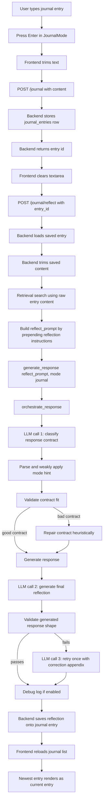

Here’s the current journal-to-response workflow.



## Frontend Steps
The frontend starts in `JournalMode`. When you press Enter, it trims the text and posts it to `/journal`.

```74:82:aic-electron/src/components/JournalMode.tsx
  const submitEntry = async () => {
    const content = journalContent.trim();
    if (!content) return;
    setError(null);
    const saveRes = await apiFetch("/journal", {
      method: "POST",
      headers: { "Content-Type": "application/json" },
      body: JSON.stringify({ content }),
```

After the save returns an `entry_id`, the frontend clears the textarea, then calls `/journal/reflect` with only the id.

```88:102:aic-electron/src/components/JournalMode.tsx
    const saveData = (await saveRes.json()) as { entry?: { id: string } };
    const entryId = saveData.entry?.id;
    setJournalContent("");
    if (entryId) {
      try {
        await apiFetch("/journal/reflect", {
          method: "POST",
          headers: { "Content-Type": "application/json" },
          body: JSON.stringify({ entry_id: entryId }),
        });
```

Important detail: the frontend currently waits for reflection before it reloads entries. So after submit, the textarea is cleared immediately, but the new entry is not loaded into UI state until the reflection request finishes.

## Storage Step
`POST /journal` stores the submitted content as-is from the request. The only frontend modification before this is `.trim()`.

```293:308:aic-backend/app/api/routes.py
@router.post("/journal")
def add_journal_entry(request: JournalEntryRequest) -> dict:
    entry = create_journal_entry(
        content=request.content,
        structured_fields=request.structured_fields,
        user_id=request.user_id,
    )
    create_item(
        source_type="journal",
        source_ref=None,
        path_or_id=entry["id"],
```

The DB insert stores `content` directly.

```21:32:aic-backend/app/storage/journal.py
    cursor.execute(
        """
        INSERT INTO journal_entries (id, content, structured_fields, created_at, user_id)
        VALUES (?, ?, ?, ?, ?)
        """,
        (
            entry_id,
            content,
```

## Reflection Route
`POST /journal/reflect` loads the entry by id, trims it again, retrieves related context using the raw entry text, then builds a new `reflect_prompt`.

```319:337:aic-backend/app/api/routes.py
    if req.entry_id:
        entry = get_journal_entry(req.entry_id)
    else:
        entries = list_journal_entries(limit=1, order="DESC")
        entry = entries[0] if entries else None
    if not entry:
        raise HTTPException(status_code=404, detail="No journal entry found")
    entry_id = entry["id"]
    entry_content = (entry.get("content") or "").strip()
    if not entry_content:
        raise HTTPException(status_code=400, detail="Journal entry has no content")
    retrieval_result = retrieve(entry_content, limit=3)
    retrieved_context = [m["content"] for m in retrieval_result.get("matches", [])]
    reflect_prompt = (
        "Reflect on this journal entry only. Name explicit themes or tensions, "
```

So the raw journal entry is **not** passed alone to the LLM. The generated prompt is:

```text
Reflect on this journal entry only. Name explicit themes or tensions,
connect ideas where it helps, and offer a concise synthesis—no platitudes.
Do not diagnose. Do not end with a stock question about feelings; substance first.

<your entry>
```

Then that prompt is passed to `generate_response(..., "journal", ...)`.

## Retrieval
Retrieval uses the raw `entry_content`, not the prefixed `reflect_prompt`.

```34:42:aic-backend/app/retrieval/search.py
def retrieve(query: str, limit: int = 5) -> Dict[str, Any]:
    query_embedding = embed_text(query)
    records = list_embeddings_with_chunks()
    scored: List[Dict[str, Any]] = []
    for record in records:
        if is_prompt_injection(record["chunk_content"]):
            continue
        similarity = cosine_similarity(query_embedding, record["embedding"])
```

It embeds the entry, compares it to stored chunk embeddings, applies a small recency boost, and returns top matches. Prompt-injection-like retrieved chunks are skipped.

## Response Entrypoint
`generate_response` is now thin; it delegates to `orchestrate_response`.

```24:42:aic-backend/app/llm/response.py
def generate_response(
    user_message: str,
    mode: str,
    retrieved_context: List[str] | None = None,
    session_id: str | None = None,
) -> Dict[str, Any]:
    """
    Generate an LLM response via response contract orchestration.
    `mode` is a weak compatibility hint only (journal, coach, exploration, crisis, advisor_workplace).
    Raises LLMUnavailableError so routes can return 503.
    """
    result = orchestrate_response(
```

For journal reflection, `session_id=None`, so no chat history is included.

## Contract Orchestrator
The orchestrator does this:

1. Load recent context if there is a session.
2. Classify the desired response contract.
3. Validate whether the contract fits the user ask.
4. Repair the contract if needed.
5. Generate response.
6. Validate response fit.
7. Retry once if validation fails.
8. Write debug metadata if enabled.
9. Return text.

```1096:1128:aic-backend/app/llm/response_contract.py
def orchestrate_response(
    user_message: str,
    mode_hint: str | None = None,
    retrieved_context: List[str] | None = None,
    session_id: str | None = None,
) -> dict[str, Any]:
    """Classify → validate contract → repair → generate → validate response → retry once."""
    recent_context = load_recent_context(session_id)
    history_messages = _history_messages_for_session(session_id)

    contract = classify_response_contract(
        user_message=user_message,
        recent_context=recent_context,
        mode_hint=mode_hint,
        retrieved_context=retrieved_context,
    )
    original_contract = contract.model_dump()

    contract_validation = validate_contract_fit(contract, user_message, mode_hint)
    contract_repaired = False
    if not contract_validation.passed:
        contract = repair_contract_from_user_ask(contract, contract_validation, user_message)
        contract_repaired = True

    response_text = generate_with_contract(
```

## LLM Calls
There are usually **two** LLM calls:

1. **Classifier call**: asks the model to return JSON describing the desired response contract.
2. **Generation call**: asks the model to write the actual reflection using that contract.

There may be a **third** LLM call if validation fails and retry is triggered.

The classifier prompt includes recent context, retrieved notes, mode hint, and the current user entry.

```739:750:aic-backend/app/llm/response_contract.py
    user_prompt = f"""Recent conversation context:
{recent_context or "(none)"}
{ctx_block}

UI mode hint (weak compatibility only, may be overridden by entry content): {mode_hint or "journal"}

Classifier hints (not rules):
- "enough for today or multi-tenancy" → requested_action: decide_between_options, decision_support, options_with_tradeoffs
- "quick thoughts" → emphasis includes keep_response_brief

Current user entry:
{user_message}
```

The generation prompt wraps the entry again with the response contract, output template, retrieved context, and recent context.

```799:810:aic-backend/app/llm/response_contract.py
    user_block = f"""Response contract:
{contract_json}
{shape_tpl}

Retrieved context, if any:
{retrieved_block or "(none)"}

Recent conversation context:
{recent_context or "(none)"}

User entry:
{user_message}"""
```

## Provider Selection
`chat_completion` decides whether to use Ollama or OpenAI based on saved LLM settings.

```55:69:aic-backend/app/llm/service.py
    llm = get_llm_settings_dict()
    passphrase = get_machine_passphrase()
    source = llm.get("model_source") or "local"

    if source == "local":
        try:
            fmt = "json" if json_output else None
            lt, npred = local_chat_inference(llm)
            return OllamaProvider().chat(
                messages,
                model=effective_ollama_model(llm),
```

Cloud OpenAI is used when `model_source` is not local and provider is OpenAI.

## Saving The Reflection
Once the response text is generated, the route saves it back to the journal entry’s `reflection` column.

```347:349:aic-backend/app/api/routes.py
    reflection_text = payload.get("text") or ""
    update_journal_reflection(entry_id, reflection_text)
    return {"text": reflection_text, "entry_id": entry_id}
```

Then the frontend reloads `/journal`, reverses the list locally, and displays newest entry as current.

```116:120:aic-electron/src/components/JournalMode.tsx
  // Most recent entry first
  const sortedEntries = [...entries].reverse();
  // The newest entry is always shown as "current"; older ones are behind the toggle
  const currentEntry = sortedEntries[0] ?? null;
  const olderEntries = sortedEntries.slice(1);
```

## Key Takeaways
The raw journal entry is modified in three important ways before response generation:

1. The frontend trims leading/trailing whitespace.
2. `/journal/reflect` wraps the entry in a fixed reflection instruction prompt.
3. The orchestrator wraps that prompt again with contract JSON, retrieved context, output-shape template, and system guidance.

The raw entry is still preserved in storage and used directly for retrieval, but the LLM does not receive it as a standalone message during journal reflection.