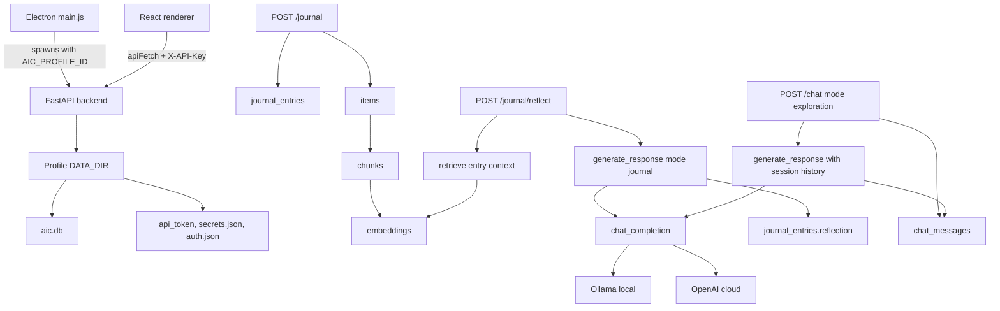

# CortexLog Backend Specification

This document is a working backend specification for CortexLog. It is intended for an outside model or engineer that needs enough context to reason about backend behavior, storage, journal/explore response logic, and the current data flow without reading the entire repository first.

## Current Scope

CortexLog is a local-first Electron + FastAPI application. The Electron frontend talks to a local backend over HTTP at `127.0.0.1:8000`. The backend stores profile-scoped user data in SQLite, routes journal/explore prompts to either a local Ollama model or OpenAI, and maintains local API-token protection for backend endpoints.

The active backend implementation lives under `aic-backend/app/`.

Important current caveat: there is active debug instrumentation from a journal-response investigation in:

- `aic-backend/app/api/routes.py`
- `aic-backend/app/llm/response.py`
- `aic-backend/app/llm/service.py`

Those logs write metadata to `debug-eff0ce.log` and should be removed after the journal-response debugging session is fully verified.

## Process And Runtime Model

### Backend Entry Point

The FastAPI app is created in `aic-backend/app/main.py`.

Startup sequence:

1. `migrate_legacy_data_files()`
2. `ensure_debug_settings_defaults()`
3. `get_api_token()` to create/read the local API token
4. `init_db()` to create/migrate SQLite schema

Routers mounted:

- `app.api.routes`
- `app.api.llm_routes`
- `app.api.modify_engine_routes`

### Authentication

All backend routes except `/health` require a local API token. The token can be sent as:

- `X-API-Key: <token>`
- `Authorization: Bearer <token>`

Token generation/validation is in `aic-backend/app/security/api_auth.py`. Token file path is `DATA_DIR / "api_token"`.

The Electron main process reads the same token via `aic-electron/main.js` and exposes it to the renderer through preload so renderer API calls can add `X-API-Key`.

### CORS

CORS allows the Vite dev renderer:

- `http://127.0.0.1:5173`
- `http://localhost:5173`

## Profile-Scoped Data Directories

Backend data directory resolution is in `aic-backend/app/core/config.py`.

On Windows, profile data lives under:

```text
%APPDATA%\CortexLog\profiles\<profile_id>\data
```

For example:

```text
C:\Users\<user>\AppData\Roaming\CortexLog\profiles\private\data
C:\Users\<user>\AppData\Roaming\CortexLog\profiles\demo\data
```

The active profile is passed through the environment variable:

```text
AIC_PROFILE_ID
```

Electron manages profile selection in `aic-electron/main.js` and restarts the backend when profiles change.

If no `AIC_PROFILE_ID` is set, manual dev/backend runs use the legacy flat data directory for compatibility.

## SQLite Storage

Database path:

```text
DATA_DIR / "aic.db"
```

Connection/init logic:

- `aic-backend/app/storage/database.py`
- `aic-backend/app/storage/schema.py`

### Core Tables

Important tables:

- `journal_entries`
  - Stores journal entry content and optional LLM reflection.
  - Columns include `id`, `content`, `structured_fields`, `created_at`, `user_id`, `reflection`.

- `chat_messages`
  - Stores Explore/chat turns.
  - Columns include `id`, `role`, `content`, `mode`, `created_at`, `session_id`.

- `items`
  - General index of ingested artifacts and journal-linked items.
  - Journal entries are mirrored here so they can be chunked and retrieved.

- `chunks`
  - Text chunks for each item.

- `embeddings`
  - Serialized embedding vectors for chunks.

- `settings`
  - JSON settings by key.
  - LLM settings use key `cortexlog_llm`.

- Other legacy/MVP tables still exist:
  - `entities`
  - `relations`
  - `provenance`
  - `proposed_insights`
  - `conflicts`
  - `feedback`
  - `word_stats`
  - `categories`
  - `llm_analysis_runs`

Some of those are not central to the current simplified Journal/Explore/Modify app surface but remain in the backend.

## LLM Settings And Provider Routing

LLM setting defaults and helpers are in:

```text
aic-backend/app/llm/llm_settings.py
```

Settings key:

```text
cortexlog_llm
```

Default settings:

```json
{
  "model_source": "local",
  "cloud_provider": "openai",
  "cloud_model": "gpt-4o-mini",
  "local_provider": "ollama",
  "local_model": null,
  "openai_temperature": 0.7,
  "openai_max_tokens": 4096,
  "local_temperature": 0.7,
  "local_num_predict": 4096,
  "local_num_ctx": 32768
}
```

Provider dispatch is in:

```text
aic-backend/app/llm/service.py
```

Dispatch rule:

- `model_source == "local"` -> `OllamaProvider`
- `model_source == "cloud"` and `cloud_provider == "openai"` -> `OpenAIProvider`
- Anthropic/Gemini are metadata/stub-level only and not implemented for chat completion.

### Ollama

Provider:

```text
aic-backend/app/llm/providers/ollama_provider.py
```

The effective local model is:

1. `cortexlog_llm.local_model`, if non-empty
2. otherwise `AIC_OLLAMA_MODEL` / default config value

Ollama options use:

- `local_temperature`
- `local_num_predict`
- `local_num_ctx`

### OpenAI

Provider:

```text
aic-backend/app/llm/providers/openai_provider.py
```

OpenAI secrets are stored in the encrypted secret store under:

- `llm_api_key_openai`
- legacy fallback: `openai_api_key`

OpenAI options use:

- `cloud_model`
- `openai_temperature`
- `openai_max_tokens`

## LLM Settings API

Defined in:

```text
aic-backend/app/api/llm_routes.py
```

Important routes:

- `GET /llm/providers`
  - Returns provider metadata.

- `GET /llm/settings`
  - Returns current `cortexlog_llm` settings plus whether secrets are configured.

- `POST /llm/settings`
  - Updates model source/provider/model and optionally stores provider API keys.

- `GET /llm/status`
  - Returns active runtime label, selected source/model settings, and reachability hints.

- `POST /llm/test`
  - Runs a real completion using current or request-provided ephemeral settings.

There are also legacy OpenAI aliases in `app/api/routes.py`. Prefer `/llm/*` for current behavior.

## Journal Data Flow

### Save Journal Entry

Route:

```text
POST /journal
```

Implementation:

```text
aic-backend/app/api/routes.py -> add_journal_entry()
```

Flow:

1. Create `journal_entries` row via `create_journal_entry()`.
2. Mirror the entry into `items` via `_index_journal_entry()`.
3. Chunk the entry with `chunk_text(max_chars=1200, overlap=150)`.
4. Create chunk rows.
5. Compute embeddings with `embed_text()`.
6. Store embeddings in `embeddings`.
7. Return the journal entry.

Purpose of mirroring journal entries into `items/chunks/embeddings`: journal content becomes retrievable context for later journal reflections and non-exploration chat modes.

### List Journal Entries

Route:

```text
GET /journal
```

Returns up to 50 entries, oldest-first by default from `list_journal_entries()`.

### Journal Reflection

Route:

```text
POST /journal/reflect
```

Implementation:

```text
aic-backend/app/api/routes.py -> journal_reflect()
```

Current flow:

1. Resolve the target entry by explicit `entry_id`, or use newest entry if no `entry_id` is provided.
2. Load entry content.
3. Find the `items` mirror for the entry using `get_item_by_path(entry_id)`.
4. Exclude that item id from retrieval.
5. Run retrieval against the entry content with `limit=3`.
6. Filter retrieved chunks exactly equal to the current entry content.
7. Call `generate_response(entry_content, "journal", retrieved_context=..., session_id=None)`.
8. Save the generated reflection into `journal_entries.reflection`.

Important current behavior:

- Journal reflection no longer uses the shared `__journal_reflect__` chat session.
- Journal reflection no longer writes journal reflection turns to `chat_messages`.
- This avoids previous assistant reflections contaminating future reflections.

### Journal Prompt Assembly

Implemented in:

```text
aic-backend/app/llm/response.py
```

`generate_response()` builds messages like:

1. Optional system message from `_build_system_prompt(mode)`.
2. Optional retrieved context message.
3. Optional chat history if `session_id` is provided.
4. Current user message, unless it duplicates the last user message.

Current journal-specific role prompt:

- Identifies the assistant as CortexLog responding to a journal entry.
- Tells the model not to continue the entry in first person.
- Tells the model not to write as if it experienced the user's day/feelings.
- Asks for grounded, proportionate, conversational response.
- Discourages grandiose praise, diagnosis, inflated interpretation, and dramatic reframing.

This prompt is currently under active review; it was added during debugging to prevent first-person continuation and overdramatic response loops.

## Explore / Chat Data Flow

### List Chat Messages

Route:

```text
GET /chat?session_id=<id>
```

Returns chat messages from `chat_messages`, latest N fetched and then reversed back to chronological order.

### Send Chat / Explore Message

Route:

```text
POST /chat
```

Request fields:

- `content`
- `mode`
- `session_id`

Flow:

1. Normalize requested mode with `normalize_mode()`.
2. If distress is detected, force `mode = "crisis"`.
3. Store user message in `chat_messages`.
4. For modes other than `exploration`, retrieve context with `retrieve()`.
5. Call `generate_response(content, mode, retrieved_context=..., session_id=session_id)`.
6. Store assistant response in `chat_messages`.
7. Return both messages and citations.

Important Explore behavior:

- Frontend sends Explore mode as `mode: "exploration"`.
- Backend skips retrieval when `mode == "exploration"`.
- Session history is included via `session_id`, so Explore can maintain conversational continuity.

## Retrieval System

Implementation:

```text
aic-backend/app/retrieval/search.py
```

Retrieval flow:

1. Embed query with `embed_text()`.
2. Load all embeddings joined to chunks and items via `list_embeddings_with_chunks()`.
3. Skip excluded item ids.
4. Skip chunks flagged by `is_prompt_injection()`.
5. Score each chunk by cosine similarity plus a small recency boost.
6. Return top `limit` chunks with item/chunk ids, content, and score.

Current limitation:

- Retrieval is in-process and scans all stored embeddings.
- No vector database/index is used.
- Duplicate or near-duplicate content can still be returned if it belongs to another `item_id`.
- Journal reflection currently filters exact string equality against the current entry, but not semantic duplicates.

## Response Generation Details

Core function:

```text
aic-backend/app/llm/response.py -> generate_response()
```

Message trimming:

- `_session_messages(session_id)` loads recent chat messages.
- `_trim_messages()` keeps the latest messages within:
  - `max_messages=48`
  - `max_chars=24000`

Provider dispatch:

```text
generate_response() -> chat_completion() -> selected provider
```

Current mode prompt behavior:

- `journal`: has a journal-specific role prompt (recently added during debugging).
- `crisis`: safety-oriented prompt based on `SAFETY_BLOCK`.
- other modes: no mode-specific system prompt unless added later.

## Ingestion And Analysis Routes

The backend still includes broader ingestion and knowledge features from earlier MVP phases.

Routes include:

- `POST /ingest/local`
- `POST /ingest/local/stream`
- `POST /ingest/gmail`
- `POST /ingest/facebook_export`
- `POST /ingest/youtube_export`
- `POST /ingest/analyze`

Local/file ingestion creates `items`, `chunks`, and embeddings. Gmail/Facebook/YouTube routes parse export/input sources and add them to the same storage/retrieval substrate.

`/ingest/analyze` runs older LLM extraction over items needing analysis. This is separate from current Journal/Explore chat generation.

## Secrets And Auth Data

Security-related modules:

- `aic-backend/app/security/api_auth.py`
- `aic-backend/app/security/auth_data.py`
- `aic-backend/app/security/encryption.py`
- `aic-backend/app/security/machine_key.py`
- `aic-backend/app/security/secret_store.py`

Data files in `DATA_DIR`:

- `api_token`
- `auth.json`
- `secrets.json`
- `.cortexlog_machine`
- `aic.db`

Secrets are encrypted with a machine-derived passphrase. The frontend should not receive raw stored provider keys after initial entry.

## Frontend/Backend Boundary

The renderer should use `aic-electron/src/lib/api.ts`.

That helper:

1. Gets the local API token through preload.
2. Adds `X-API-Key`.
3. Calls `http://127.0.0.1:8000`.

Electron main is responsible for:

- determining active profile
- spawning/restarting the backend
- passing `AIC_PROFILE_ID`
- reading the profile API token
- exposing safe IPC helpers through preload

## Known Current Issues And Caveats

1. Debug instrumentation is currently active in backend response paths and should be removed once the current journal-response debugging session is complete.

2. The journal role prompt is new and may need tone tuning. It currently prevents first-person continuation and overdramatic framing, but the exact wording is under review.

3. The broader backend still contains legacy routes/tables for knowledge, proposed insights, conflicts, Gmail, etc. They may not all be part of the current simplified product surface.

4. There are duplicate/legacy OpenAI routes in `app/api/routes.py` in addition to the newer `/llm/*` routes in `app/api/llm_routes.py`. New work should prefer `/llm/*`.

5. Retrieval can still surface semantically duplicate entries if exact text differs. Current journal reflection only filters exact duplicates equal to the current entry.

6. Explore mode skips retrieval and relies on session history. Journal reflection uses retrieval but no chat session history.

7. Dependency hygiene still needs follow-up in the Electron project; this is separate from backend behavior but relevant to distribution readiness.

## Practical Debugging Queries

Inspect active profile:

```powershell
Get-Content "$env:APPDATA\CortexLog\app_settings.json"
```

Inspect a profile LLM setting:

```powershell
python -c "import sqlite3,json,sys; con=sqlite3.connect(sys.argv[1]); row=con.execute('select key,value,updated_at from settings where key=?',('cortexlog_llm',)).fetchone(); print(row); con.close()" "$env:APPDATA\CortexLog\profiles\private\data\aic.db"
```

Inspect recent journal entries:

```powershell
python -c "import sqlite3,json,sys; con=sqlite3.connect(sys.argv[1]); con.row_factory=sqlite3.Row; rows=con.execute('select id,created_at,substr(content,1,300),substr(coalesce(reflection,''),1,300) from journal_entries order by created_at desc limit 5').fetchall(); print(json.dumps([tuple(r) for r in rows], indent=2)); con.close()" "$env:APPDATA\CortexLog\profiles\private\data\aic.db"
```

Check live LLM settings through API:

```powershell
$token = (Get-Content "$env:APPDATA\CortexLog\profiles\private\data\api_token" -Raw).Trim()
Invoke-RestMethod -Uri "http://127.0.0.1:8000/llm/settings" -Headers @{ "X-API-Key" = $token }
```

## High-Level Backend Flow Diagram



